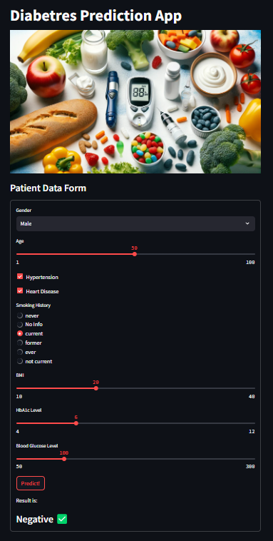

## Diabetes Prediction ML Model and Streamlit App

## Overview

This repository contains a machine learning model for predicting diabetes and a Streamlit application to interact with the model.

## Table of Contents
- [Installation](#installation)
- [Model Training](#model-training)
- [Streamlit Application](#streamlit-application)

### Installation
1. Clone the repository.
2. Change into the project directory on **'Diabetes_prediction'**
3. Install the required dependencies by command: 
   * pip install -r requirements.txt
   
### Model Training 
1. Execute Jupyther notebook: **"diabetes_prediction.ipynb"**
2. The trained model is saved as **model.joblib** in the root folder.
3. The trained model will be used by Streamlit application.

### Streamlit Application
1. Run the application by command: 
   * streamlit run app.py
2. Application looks like this: 
